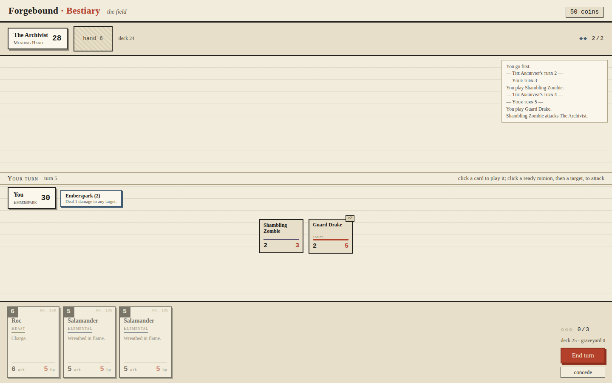

# Forgebound: Bestiary

A two-player dueling card game (Hearthstone-lite): 30-life heroes, mana climbing
1→10, minions with summoning sickness, spells, seven selectable hero powers, and a
299-entry bestiary set with tribal synergy across 12 tribes. Play against the AI or
hot-seat against a friend; win coins, buy packs, and build decks from your
collection — everything persists locally between sessions.



## Run it

```sh
git clone https://github.com/ShaneEnochs/Cardgame.git
cd Cardgame
npm start
```

Then open **http://localhost:5173**. That's the whole setup: Node 18+ and a browser,
no install step, zero dependencies. Progress (coins, collection, decks, record) is
saved in the browser's localStorage and survives closing the app.

## Test it

```sh
npm test           # 65 tests: engine rules, card effects, AI-vs-AI full games, meta
npm run balance    # card-set balance audit (see below)
```

## What's here

| Piece | Where |
| --- | --- |
| Card data (authoritative, loaded not retyped) | `data/cards.json` |
| Rules engine — pure data in/out, validated between actions | `src/engine/` |
| Every card effect + the 7 hero powers | `src/engine/effects.js` |
| Heuristic AI opponent | `src/engine/ai.js` |
| Balance model + intentional-outlier allowlist | `src/engine/balance.js` |
| Coins, collection, packs, decks, persistence | `src/meta/` |
| UI (board, hot-seat pass screen, deckbuilder, shop) | `src/ui/` |
| Decision log / ambiguity calls | `NOTES.md` |

The engine state is a single JSON-serializable object; every action goes through one
reducer that validates structural invariants afterwards, and targeting state lives
only in the UI — so a pending target or attacker selection can never leak into, or
corrupt, the game state.

## Balance

The set follows the model **atk + hp + keyword costs ≈ cost×2 + 1** (tolerance ±2).
`npm run balance` prints the deviation histogram and fails if any card drifts out of
tolerance without being an allowlisted intentional outlier — and also if an
allowlisted card quietly stops being an outlier. Five intentional outliers are
currently allowlisted: Tarrasque, Nosferatu, Lich, Mummy Lord, Wailing Banshee.

## Stack

Vanilla ES-module JavaScript, no framework, no build step, zero npm dependencies —
the repo's prototype was plain HTML/JS and nothing in this game needs more. The
engine has no DOM dependencies and runs headless under `node --test` (including full
AI-vs-AI games over the whole card pool); the UI is a thin DOM layer over it.

## Art direction

Printed field-guide: ink on unbleached paper, flat vermilion and slate accents,
hard-edged square-cornered cards with a rectangular cost tab and per-tribe underline
— chosen because a light, print-like board keeps fourteen minions readable at a
glance, and because it deliberately avoids the stock AI-generated look
(teal-and-copper on dark, Cinzel display type, glowing borders, radial vignettes,
circular cost badges).
